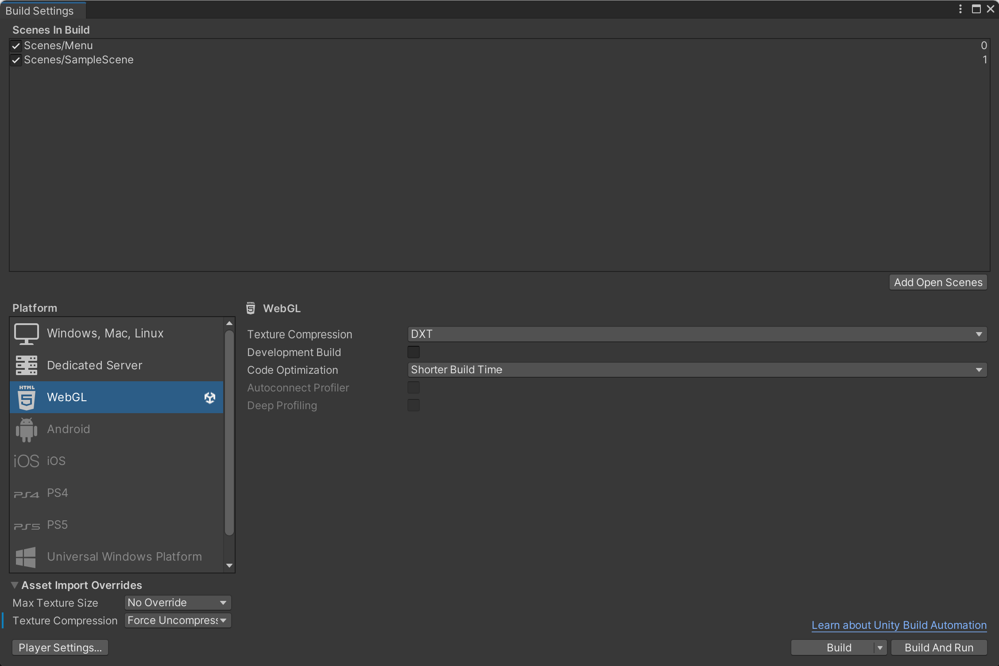

# Games

<div align="center">
 
<br>


<br />

<a href="https://unity.com/">
  
</a>

<a href="https://learn.microsoft.com/en-us/dotnet/csharp/">
  
</a>


<h2>Games made for Blue CoLab!</h2>
</div>

## About the Project

### Flappy

Flappy is a Flappy Bird clone that is ocean themed

### Dinosaur Game

Dinosaur game is a Google Chrome-inspired game that is themed to Blue CoLab

### Features

Check it out here: bluecolab.github.io/Games/ !

## Required Software

- [git](https://git-scm.com/) - version control. For installing git, please see the [git website](https://git-scm.com/).
- [Unity Hub](https://unity.com/) - Unity manager. For installing, please see [Unity website](https://unity.com/download).
    - Editor version used: `2022.3.11f1`

## Recommended Software

- [VS Code](https://code.visualstudio.com/) - code editor
- [GitHub CLI](https://cli.github.com/) - CLI for GitHub

## Getting Started (one-time steps)

1. Install all the software above.
2. Clone the repo by running:
    ```bash
    git clone https://github.com/bluecolab/Games.git
    ```
3. Open Unity Hub, click on 'Add' > 'Add project from disk'.
4. Download editor `2022.3.11f1` if you haven't already.
   
## Running locally on computer via Expo Go

1. Open Unity Hub and start the project.
2. Make sure you are in the `react-kiosk`.
3. Start coding!

## Deployment
To build the web-build for the react-kiosk we use a WebGL Build.
1. First setup Unity to be able to make WebGL Builds. See here: https://www.youtube.com/watch?v=X8Njwk4IRo0.
2. Click on File > Build Settings > WebGL
3. Make sure your settings are as follows:


4. There should be no texture compression under asset imports. And select 'DXT` compression under 'WebGL'
5. Click on Build, you can replace the previous build.
6. Push to GitHub, this will deploy to GitHub pages.

## File structure

### High level overview:

```
Games - Parent folder
├───Dinosaur Game Build - Web build of  Dinosaur Game/Cronin Cruise
├───Dinosaur Game - Unity Project for Dinosaur Game/Cronin Cruise - Edit this!
├───Flappy Game Build - Web build of Flappy Bird/Splashy Fish
└───Flappy - Unity Project for Flappy Bird/Splashy Fish - Edit this!
```
